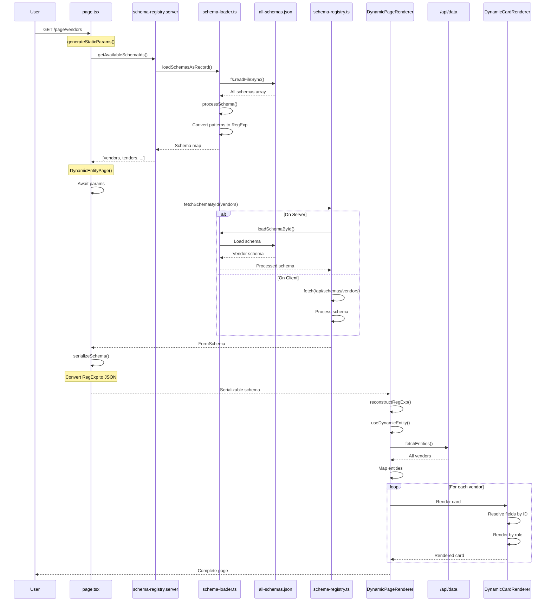
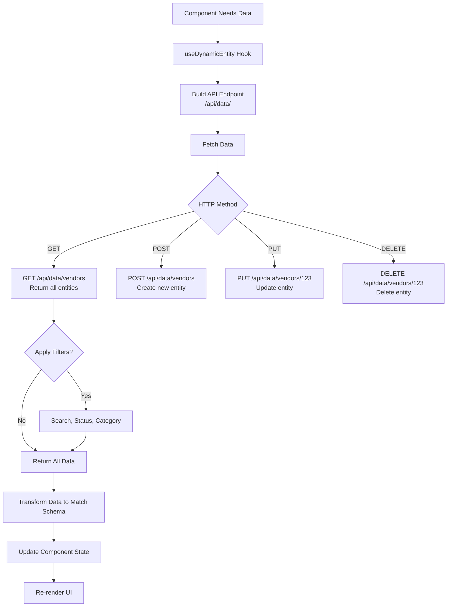

# Schema to Page Generation Flow Architecture

## Complete Flow Diagram

```mermaid
flowchart TB
    %% User Request Entry Point
    UserRequest[User Navigates to /page/vendors] --> NextRoute
    
    %% Next.js Route Layer
    NextRoute[Next.js Route: src/app/page/ schema-id /page.tsx]
    NextRoute --> GenerateStaticParams{Generate Static Params}
    
    %% Static Generation
    GenerateStaticParams --> SchemaRegistryServer[schema-registry.server.ts<br/>getAvailableSchemaIds]
    SchemaRegistryServer --> GetAllSchemasSync{getAllSchemasSync<br/>Check Cache}
    
    GetAllSchemasSync -->|Cache Hit<br/><5s old| ReturnCachedIds[Return Cached Schema IDs]
    GetAllSchemasSync -->|Cache Miss| LoadSchemasAsRecord[loadSchemasAsRecord]
    
    LoadSchemasAsRecord --> SchemaLoader[Load from<br/>schema-loader.ts]
    SchemaLoader --> ReadJSONFile[Read File:<br/>data/all-schemas.json]
    ReadJSONFile --> ParseJSON[Parse JSON Array<br/>3084 lines]
    ParseJSON --> ProcessSchemas[Process Each Schema<br/>processSchema function]
    
    ProcessSchemas --> ConvertPatterns[Convert String Patterns<br/>to RegExp objects]
    ConvertPatterns --> BuildSchemaMap[Build Schema Map<br/>Key: schema.id<br/>Value: FormSchema]
    BuildSchemaMap --> UpdateCache[Update Server Cache<br/>TTL: 5s]
    UpdateCache --> ReturnCachedIds
    
    ReturnCachedIds --> GenerateParams[Generate Static Params<br/>[{schema-id: vendors}, ...]]
    
    %% Page Rendering
    GenerateParams --> PageComponent[DynamicEntityPage Component]
    PageComponent --> AwaitParams[Await params<br/>schema-id = vendors]
    AwaitParams --> FetchSchemaById[fetchSchemaById<br/>schema-registry.ts]
    
    %% Schema Fetching Logic
    FetchSchemaById --> CheckEnvironment{Check Environment<br/>Server vs Client}
    
    %% Server-Side Path
    CheckEnvironment -->|Server Side<br/>window === undefined| LoadSchemaById[schema-loader.ts<br/>loadSchemaById]
    LoadSchemaById --> GetAllSchemasFind[loadAllSchemas<br/>Find by ID]
    
    %% Client-Side Path
    CheckEnvironment -->|Client Side<br/>window defined| FetchAPI[Fetch API:<br/>/api/schemas/vendors]
    
    %% API Route
    FetchAPI --> APIRoute[API Route:<br/>src/app/api/schemas/ route.ts]
    APIRoute --> ReadJSONFile2[Read File:<br/>data/all-schemas.json]
    ReadJSONFile2 --> FindSchema[Find Schema<br/>by ID in Array]
    
    %% Schema Processing
    FindSchema --> ProcessSchemas2[Process Schema<br/>processSchema]
    GetAllSchemasFind --> ProcessSchemas2
    ProcessSchemas2 --> ConvertPatterns2[Convert Patterns<br/>to RegExp]
    ConvertPatterns2 --> SerializeSchema[Serialize Schema<br/>serializeSchema function]
    
    %% RegExp Serialization
    SerializeSchema --> DetectRegExp{Check for RegExp<br/>instances}
    DetectRegExp -->|Found RegExp| ConvertToJSON[Convert to:<br/>{__regexp: true,<br/>source, flags}]
    ConvertToJSON --> SafeForClient[Safe for Client Component]
    DetectRegExp -->|No RegExp| SafeForClient
    
    %% Component Rendering
    SafeForClient --> SchemaFetched[Schema Fetched<br/>serializedSchema]
    SchemaFetched --> CheckSchemaExists{Schema Exists?}
    
    CheckSchemaExists -->|No| NotFound[notFound<br/>404 Page]
    CheckSchemaExists -->|Yes| DynamicPageRenderer[DynamicPageRenderer<br/>Client Component]
    
    %% Dynamic Page Renderer
    DynamicPageRenderer --> ReconstructRegExp[Reconstruct RegExp<br/>Objects from JSON]
    ReconstructRegExp --> RebuildRegExp[Convert JSON to RegExp<br/>new RegExp source, flags]
    RebuildRegExp --> FullSchema[Full FormSchema<br/>with RegExp patterns]
    
    FullSchema --> UseDynamicEntity[useDynamicEntity Hook]
    UseDynamicEntity --> FetchEntities[fetchEntities<br/>Load Data from API]
    
    %% Data Loading
    FetchEntities --> DataAPI[API: /api/data/<schema-id>]
    DataAPI --> ReturnData[Return Entities Array]
    ReturnData --> EntitiesLoaded[Entities Loaded<br/>All vendor records]
    
    %% UI Rendering
    EntitiesLoaded --> RenderMainLayout[Render MainLayout<br/>Title: Vendors Management]
    RenderMainLayout --> RenderFilterPane[DynamicFilterPane<br/>Search & Filters]
    RenderFilterPane --> RenderGrid[Dynamic Card Grid<br/>DynamicCardRenderer]
    
    %% For Each Entity Card
    RenderGrid --> MapEntities[Map Over Entities<br/>Array]
    MapEntities --> DynamicCardRenderer[DynamicCardRenderer<br/>For Each Vendor Card]
    
    DynamicCardRenderer --> ResolveCardMetadata[Resolve cardMetadata<br/>from Schema]
    ResolveCardMetadata --> GetFieldValues[Get Field Values<br/>by fieldIds]
    GetFieldValues --> RenderCardFields[Render Card Fields<br/>Based on Roles:<br/>title, subtitle, badge, etc]
    
    %% User Interactions
    RenderCardFields --> UserClicksCard{User Clicks Card}
    UserClicksCard -->|View Details| OpenDetailDialog[DynamicCardDialog<br/>Quick Preview]
    UserClicksCard -->|View Detail Page| NavigateToDetail[Navigate to<br/>/page/vendors/123]
    UserClicksCard -->|Edit| OpenEditModal[Open Edit Modal<br/>SchemaFormWrapper]
    UserClicksCard -->|Delete| DeleteEntity[Delete Entity<br/>via API]
    
    %% Complete Page Render
    OpenDetailDialog --> RenderedPage[Rendered Page<br/>Complete UI]
    OpenEditModal --> RenderedPage
    DeleteEntity --> RefreshData[Refresh Data<br/>fetchEntities]
    RefreshData --> RenderGrid
    
    %% Styling
    classDef requestClass fill:#e1f5ff,stroke:#01579b,stroke-width:2px
    classDef routeClass fill:#f3e5f5,stroke:#4a148c,stroke-width:2px
    classDef schemaClass fill:#fff3e0,stroke:#e65100,stroke-width:2px
    classDef processClass fill:#e8f5e9,stroke:#1b5e20,stroke-width:2px
    classDef renderClass fill:#fce4ec,stroke:#880e4f,stroke-width:2px
    classDef dataClass fill:#e0f2f1,stroke:#004d40,stroke-width:2px
    classDef userClass fill:#fff9c4,stroke:#f57f17,stroke-width:2px
    
    class UserRequest,NextRoute,GenerateStaticParams requestClass
    class SchemaRegistryServer,GetAllSchemasSync,LoadSchemasAsRecord,SchemaLoader routeClass
    class ReadJSONFile,ParseJSON,ProcessSchemas,ConvertPatterns,BuildSchemaMap schemaClass
    class SerializeSchema,DetectRegExp,ConvertToJSON,SafeForClient,ReconstructRegExp,RebuildRegExp processClass
    class DynamicPageRenderer,RenderMainLayout,RenderFilterPane,RenderGrid,DynamicCardRenderer renderClass
    class FetchEntities,DataAPI,ReturnData,EntitiesLoaded,GetFieldValues,RenderCardFields dataClass
    class UserClicksCard,OpenDetailDialog,OpenEditModal,DeleteEntity,NavigateToDetail userClass
```

## Key Components Flow



## Schema Processing Flow

```mermaid
flowchart LR
    RawSchema[Raw Schema from JSON] --> CheckStructure{Has Old Structure?<br/>fields in sections}
    
    CheckStructure -->|Yes| TransformStructure[Transform to New Structure<br/>Extract fields to top level]
    CheckStructure -->|No| ProcessFields
    
    TransformStructure --> ProcessFields[Process Each Field]
    ProcessFields --> CheckPattern{Has Pattern String?}
    
    CheckPattern -->|Yes| ConvertToRegExp[stringToRegExp<br/>new RegExp pattern]
    CheckPattern -->|No| ProcessedField[Processed Field]
    
    ConvertToRegExp --> ProcessedField
    ProcessedField --> ProcessedSchema[Processed FormSchema]
    
    ProcessedSchema -->|Server Side| CacheSchema[Cache in Memory<br/>5s TTL]
    ProcessedSchema -->|Client Side| SerializeForClient
    
    CacheSchema --> ReadyForUse[Schema Ready]
    SerializeForClient --> CheckRegExpInstances{Has RegExp?}
    
    CheckRegExpInstances -->|Yes| SerializeRegExp[{__regexp: true,<br/>source, flags}]
    CheckRegExpInstances -->|No| ReadyForClient[Serialized Schema]
    
    SerializeRegExp --> ReadyForClient
    ReadyForClient --> ReadyForUse
    
    ReadyForUse --> ToComponent[Pass to Component]
```

## Data Flow



## File Structure

```
📁 data/
  └── all-schemas.json (3084 lines, 6 schemas)

📁 src/
  ├── app/
  │   ├── page/
  │   │   └── [schema-id]/
  │   │       ├── page.tsx (Server Component)
  │   │       └── [data-id]/
  │   │           ├── page.tsx
  │   │           └── DynamicDetailPageClient.tsx
  │   └── api/
  │       ├── schemas/
  │       │   ├── route.ts (GET all schemas)
  │       │   └── [schema-id]/
  │       │       └── route.ts (GET single schema)
  │       └── data/
  │           └── [schema-id]/
  │               └── route.ts (CRUD operations)
  │
  ├── components/
  │   └── dynamic/
  │       └── DynamicPageRenderer.tsx (Client Component)
  │
  ├── shared/
  │   ├── utils/
  │   │   ├── schema-registry.ts (Universal functions)
  │   │   ├── schema-registry.server.ts (Server-only)
  │   │   └── schema-loader.ts (Server-only file I/O)
  │   └── types/
  │       └── form-schema.ts (TypeScript types)
  │
  └── gradian-ui/
      └── data-display/
          └── components/
              ├── DynamicCardRenderer.tsx
              ├── DynamicDetailPageRenderer.tsx
              └── DynamicInfoCard.tsx
```

## Key Processing Steps

### 1. Schema Loading (Server-Side)
- Read `data/all-schemas.json` using Node.js `fs.readFileSync()`
- Parse JSON array of schemas
- Convert string patterns to `RegExp` objects
- Cache in memory with 5-second TTL for hot reload

### 2. Schema Serialization
- Before passing to client, serialize `RegExp` to JSON
- Pattern: `{__regexp: true, source: "...", flags: "..."}`
- Makes schema safe for `next/navigation` and serialization

### 3. Schema Reconstruction (Client-Side)
- Receive serialized schema
- Reconstruct `RegExp` objects from JSON markers
- Restore full schema with working validation patterns

### 4. Data Loading
- Use `useDynamicEntity` hook
- Fetch entities from `/api/data/<schema-id>`
- Apply search/filter logic
- Transform data to match schema structure

### 5. UI Rendering
- Render cards using `DynamicCardRenderer`
- Resolve fields by ID from schema
- Render based on field roles (title, subtitle, badge, etc.)
- Handle user interactions (view, edit, delete)

## Cache Strategy

```
┌─────────────────────────────────────────────────────────┐
│ Server Cache (schema-registry.server.ts)                │
│ - 5 second TTL in development                            │
│ - No expiry in production                                │
│ - Clears on file changes (hot reload)                    │
└─────────────────────────────────────────────────────────┘
                         ↓
┌─────────────────────────────────────────────────────────┐
│ Next.js Static Generation Cache                          │
│ - Generated at build time                                │
│ - Cached per schema ID                                   │
│ - Revalidated based on route config                      │
└─────────────────────────────────────────────────────────┘
                         ↓
┌─────────────────────────────────────────────────────────┐
│ Client-Side React State                                  │
│ - Component-level state                                  │
│ - No cache by default                                    │
│ - Fetches fresh data on mount                            │
└─────────────────────────────────────────────────────────┘
```

## Performance Optimizations

1. **Static Generation**: Pre-generate all schema pages at build time
2. **Server Cache**: 5-second TTL to reduce file I/O during development
3. **Lazy Loading**: Schemas loaded only when needed
4. **Pattern Conversion**: Done once on load, not per render
5. **Serialization**: Only for client-bound schemas

## Configuration

### Changing Schema API Route

The schema fetching API route is configurable via environment variables:

**Default Route**: `/api/schemas`

**To Change**: Add to your `.env.local`:
```bash
NEXT_PUBLIC_SCHEMA_API_BASE="/custom/api/schemas"
```

This affects:
- Client-side schema fetching from `schema-registry.ts`
- All dynamic schema lookups on the client
- API calls for individual schemas (e.g., `/api/schemas/vendors`)

**Configuration Location**: `src/lib/config.ts`
```typescript
schemaApi: {
  basePath: process.env.NEXT_PUBLIC_SCHEMA_API_BASE || '/api/schemas',
}
```

**Note**: Server-side schema loading (from `schema-loader.ts`) is not affected as it reads directly from `data/all-schemas.json`.

